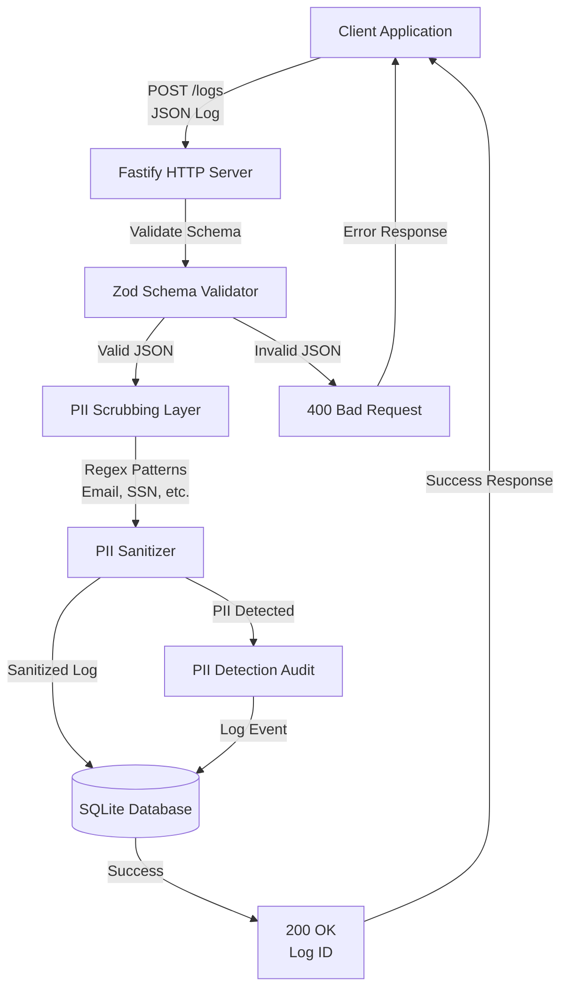

# Change: Audit Ingest with PII Scrubbing

## Why
Banking clients need a secure HTTP endpoint to ingest application audit logs. Developers often accidentally log PII (emails, SSNs) in message bodies, creating compliance and security risks. We need a service that validates, sanitizes PII, and stores clean logs securely.

## What Changes
- Add `POST /logs` HTTP endpoint for audit log ingestion
- Implement JSON schema validation using Zod
- Add PII scrubbing layer with regex pattern matching
- Create SQLite database storage for sanitized logs
- Add error handling for malformed JSON and validation failures

## Impact
- Affected specs: New `audit-ingest` capability
- Affected code: New Fastify server, PII scrubbing service, SQLite integration

## Logical Architecture

### Components
1. **Fastify HTTP Server**: Receives POST requests on `/logs` endpoint
2. **Zod Schema Validator**: Validates incoming JSON against defined schema
3. **PII Scrubbing Layer**: Applies regex patterns to detect and sanitize PII
4. **PII Sanitizer**: Replaces detected PII with placeholders (e.g., `[EMAIL_REDACTED]`)
5. **SQLite Database**: Stores sanitized logs with metadata
6. **PII Detection Audit**: Logs when PII is detected for compliance tracking

## Risk Register

| Risk ID | Risk Description | Impact | Likelihood | Mitigation |
|---------|------------------|--------|------------|------------|
| R1 | **PII Data Leakage** - PII not properly sanitized before storage | Critical | Medium | Implement comprehensive regex patterns, add validation tests, audit PII detection events |
| R2 | **Incomplete PII Detection** - New PII formats not covered by regex | High | High | Use multiple regex patterns, implement pattern update mechanism, log all sanitization actions |
| R3 | **SQL Injection** - Malicious input in log data | Critical | Low | Use parameterized queries, validate all inputs through Zod schema |
| R4 | **Data Loss** - Database write failures not handled | Medium | Low | Implement transaction rollback, error logging, retry mechanism for critical operations |
| R5 | **Performance Degradation** - Regex processing slows down ingestion | Medium | Medium | Optimize regex patterns, consider async processing, add performance monitoring |
| R6 | **False Positives** - Legitimate data flagged as PII | Low | Medium | Fine-tune regex patterns, allow configuration of patterns, log false positive events |
| R7 | **Schema Validation Bypass** - Malformed JSON processed | High | Low | Strict Zod validation, reject invalid schemas immediately, return clear error messages |
| R8 | **PII in Error Messages** - PII leaked in error responses | High | Low | Sanitize all error messages, never return raw input in errors, use generic error messages |

## Core Scenarios

### Scenario 1: Happy Path - Valid Log with PII Sanitization
- **WHEN** a client sends a valid JSON log containing PII (e.g., email: `user@example.com`, SSN: `123-45-6789`)
- **THEN** the system validates the JSON schema using Zod
- **AND** the PII scrubbing layer detects and sanitizes the PII
- **AND** the sanitized log (with placeholders like `[EMAIL_REDACTED]`, `[SSN_REDACTED]`) is stored in SQLite
- **AND** a PII detection audit event is logged
- **AND** a `200 OK` response is returned with the log ID
- **AND** the original PII is never stored in the database

### Scenario 2: Malformed JSON - Invalid Request
- **WHEN** a client sends malformed JSON (e.g., missing closing brace, invalid syntax)
- **THEN** the Fastify server detects the JSON parsing error
- **AND** a `400 Bad Request` response is returned immediately
- **AND** no data is processed or stored
- **AND** the error response contains a generic message (no PII in error)
- **AND** the error is logged for monitoring

### Scenario 3: Schema Validation Failure
- **WHEN** a client sends valid JSON that doesn't match the required schema (e.g., missing required fields, wrong data types)
- **THEN** Zod validation fails
- **AND** a `400 Bad Request` response is returned with validation error details (sanitized)
- **AND** no data is processed or stored
- **AND** the validation errors are logged

### Scenario 4: Valid Log Without PII
- **WHEN** a client sends a valid JSON log with no PII detected
- **THEN** the system validates the JSON schema
- **AND** the PII scrubbing layer processes the log but finds no PII
- **AND** the log is stored in SQLite as-is
- **AND** a `200 OK` response is returned with the log ID
- **AND** no PII detection audit event is created

